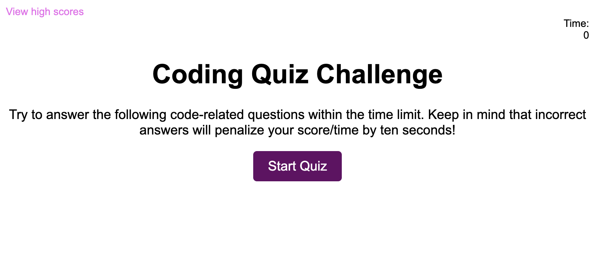
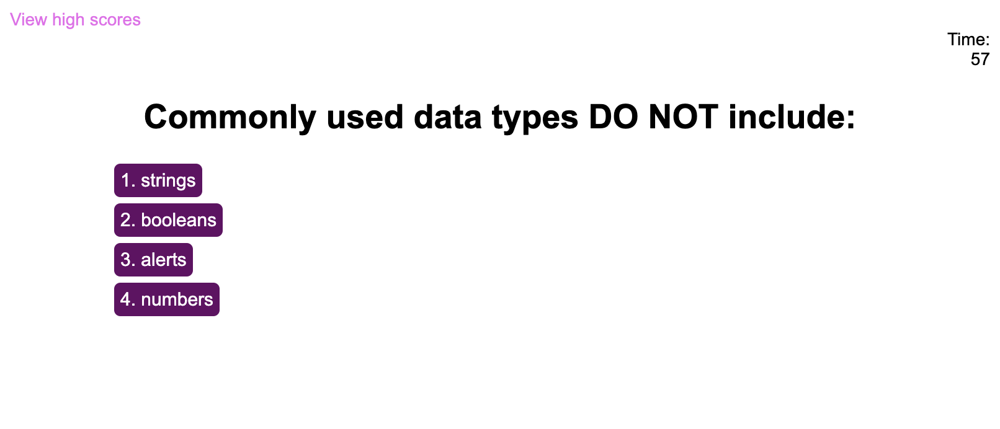
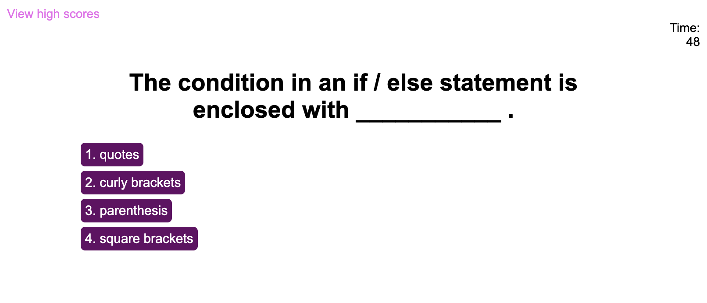
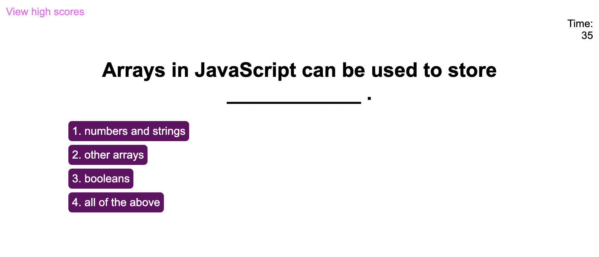
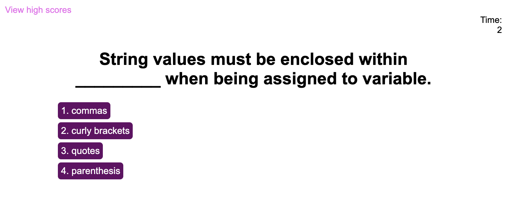
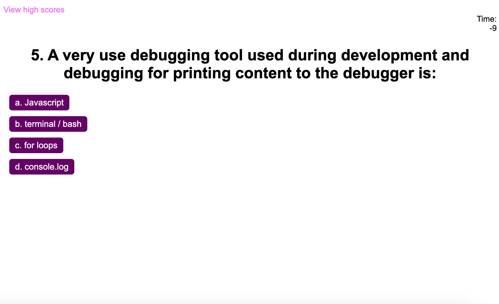
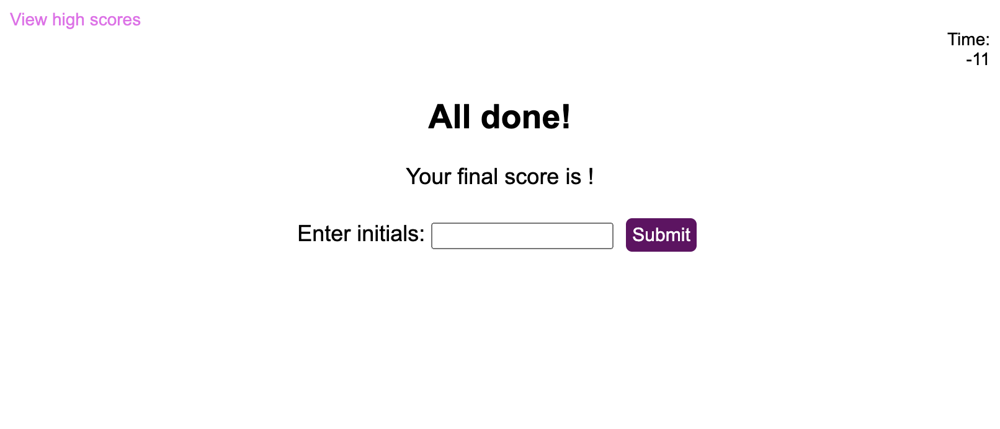

# Coding-Quiz
A timed coding quiz with multiple-choice questions.

## Table of Contents
* [Description](#description)
* [Future Development](#future-development)
* [Mock-Up](#mock-up)
* [My Coding Quiz](#my-coding-quiz)
* [Links to the Coding Quiz](#links-to-the-coding-quiz)
* [Questions](#questions)

## Description

This application creates a timed coding quiz with multiple-choice questions. If the user gets an answer wrong they will be penalized by losing time off the clock. The test will end when either the user answers all questions or the timer reaches 0. At which point the user can save their initials with their score. 

## Future Development

As I continue working on this quiz I will include the functionality to save scores to local storage, include the timer penalization for incorrect answers, update the end screen with a value for the score, as well as the "correct/wrong" feedback after each answer choice is selected.

## Mock-Up
The following animation shows what the intended functionality and appearance of the Coding Quiz is:

## My Coding Quiz:
This following screenshots show the appearance of the Coding Quiz:

Screen Recording [Video](https://drive.google.com/file/d/1J1Eh1fVU6pA4F0Lc_2L7wx10b2XbprSf/view) of my Coding Quiz.

## Links to the Coding Quiz:

- [GitHub Repository](https://github.com/kdrummond528/Coding-Quiz.git)

- [Deployed Application](https://kdrummond528.github.io/Coding-Quiz/)

## Questions

Feel free to [email me](mailto:k.drummond528@gmail.com) with any questions, comments, or requests.

Checkout my [GitHub](https://github.com/kdrummond528)!

View [My Portfolio](https://kdrummond528.github.io/Personal-Portfolio/)!