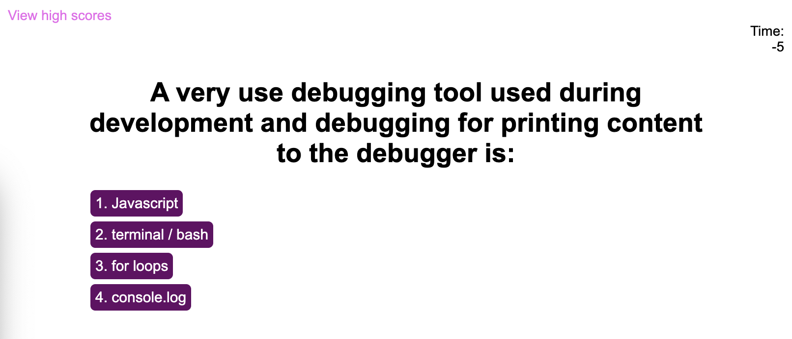

# Coding-Quiz
The objective of this challenge is to create timed coding quiz with multiple-choice questions. If the user gets an answer wrong they will be penalized by losing time off the clock. The test will end when either the user answers all questions or the timer reaches 0. At which point the user can save their initials and scores. 

## Challenges making the Coding Quiz
I faced many challenges making this quiz. So far in the bootcamp JavaScript has been more difficult for me to learn than HTML and CSS. It was a challenge to figure how to properly display the questions (titles, and answers) in order back to back, however I was able to code it correctly to do so. 

Unforuntately, I ran out of time and was unable to code some of the remaining JavaScript code such as the display of "right/wrong" for each answer choice selected, the end screen displaying at the end of the quiz including the ability to save the user's score, the penalization on time for wrong choices, etc.

## Mock-up:
The following animation shows what the intended functionality and appearance of the Coding Quiz is:

## Actual Coding Quiz:
This following screenshots show the appearance of my personal porfolio:

## Links to the Coding Quiz:
git@github.com:kdrummond528/Coding-Quiz.git
